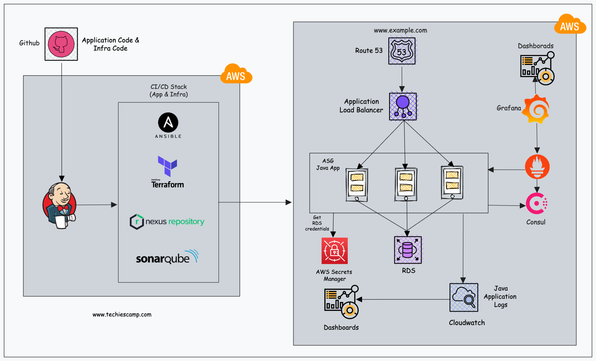

# App infra

# VPC CIDR Block

10.0.0.0/16

# Public Subnets

| Subnet Name        | Availability Zone | CIDR Block  | Type   |
| ------------------ | ----------------- | ----------- | ------ |
| Prod-Web-Public-1a | us-east-1a        | 10.0.1.0/24 | Public |
| Prod-Web-Public-1b | us-east-1b        | 10.0.2.0/24 | Public |
| Prod-Web-Public-1c | us-east-1c        | 10.0.3.0/24 | Public |

# Application Subnets

| Subnet Name         | Availability Zone | CIDR Block  | Type    |
| ------------------- | ----------------- | ----------- | ------- |
| Prod-App-Private-1a | us-east-1a        | 10.0.4.0/24 | Private |
| Prod-App-Private-1b | us-east-1b        | 10.0.5.0/24 | Private |
| Prod-App-Private-1c | us-east-1c        | 10.0.6.0/24 | Private |

# Database Subnets

| Subnet Name        | Availability Zone | CIDR Block  | Type    |
| ------------------ | ----------------- | ----------- | ------- |
| Prod-DB-Private-1a | us-east-1a        | 10.0.7.0/24 | Private |
| Prod-DB-Private-1b | us-east-1b        | 10.0.8.0/24 | Private |
| Prod-DB-Private-1c | us-east-1c        | 10.0.9.0/24 | Private |

# Management Subnets

| Subnet Name          | Availability Zone | CIDR Block   | Type    |
| -------------------- | ----------------- | ------------ | ------- |
| Prod-Mgmt-Private-1a | us-east-1a        | 10.0.10.0/24 | Private |
| Prod-Mgmt-Private-1b | us-east-1b        | 10.0.11.0/24 | Private |
| Prod-Mgmt-Private-1c | us-east-1c        | 10.0.12.0/24 | Private |

# Platform Subnets

| Subnet Name              | Availability Zone | CIDR Block   | Type    |
| ------------------------ | ----------------- | ------------ | ------- |
| Prod-Platform-Private-1a | us-east-1a        | 10.0.13.0/24 | Private |
| Prod-Platform-Private-1b | us-east-1b        | 10.0.14.0/24 | Private |
| Prod-Platform-Private-1c | us-east-1c        | 10.0.15.0/24 | Private |

# Route Table Design

| Subnet     | Destination CIDR | Target           |
| ---------- | ---------------- | ---------------- |
| Public     | 0.0.0.0/0        | Internet Gateway |
| App        | 0.0.0.0/0        | Nat Gateway      |
| DB         | 0.0.0.0/0        | Nat Gateway      |
| Management | 0.0.0.0/0        | Nat Gateway      |

# Network ACLs

## DB NACL (Inbound Rules)

| Rule Number | Type        | Protocol | Port Range | Source IP    | Allow/Deny |
| ----------- | ----------- | -------- | ---------- | ------------ | ---------- |
| 100         | Custom TCP  | TCP      | 3306       | 10.0.4.0/24  | Allow      |
| 110         | Custom TCP  | TCP      | 3306       | 10.0.5.0/24  | Allow      |
| 120         | Custom TCP  | TCP      | 3306       | 10.0.6.0/24  | Allow      |
| 130         | Custom TCP  | TCP      | 3306       | 10.0.10.0/24 | Allow      |
| 140         | Custom TCP  | TCP      | 3306       | 10.0.11.0/24 | Allow      |
| 150         | Custom TCP  | TCP      | 3306       | 10.0.12.0/24 | Allow      |
| \*          | All Traffic | All      | All        | 0.0.0.0/0    | Deny       |

## DB NACL (Outbound Rules)

| Rule Number | Type        | Protocol | Port Range | Destination IP | Allow/Deny |
| ----------- | ----------- | -------- | ---------- | -------------- | ---------- |
| 100         | Custom TCP  | TCP      | 3306       | 10.0.7.0/24    | Allow      |
| 110         | Custom TCP  | TCP      | 3306       | 10.0.8.0/24    | Allow      |
| 120         | Custom TCP  | TCP      | 3306       | 10.0.9.0/24    | Allow      |
| \*          | All Traffic | All      | All        | 0.0.0.0/0      | Deny       |

# VPC Endpoints

s3, secrets manger and Cloudwatch services
